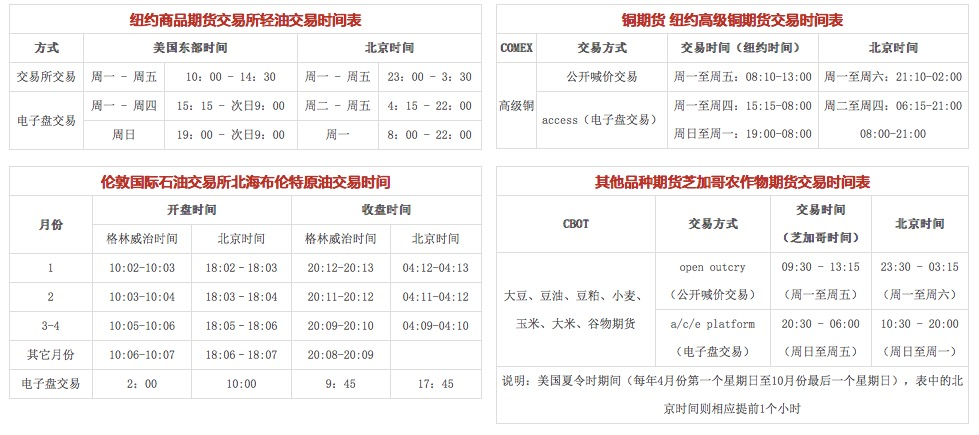

# 2016年年度计划

----------------------------------------------------------------2016.01.20~2017.01.20
##第一阶段(2016.01.20~2017.05.20)

```
学习。 以学习为主，注意积累总结，
同时对现有数据进行预测，总结失败与成功的原因，并记录经验心得。
```
##第二阶段(2016.05.20~2016.09.20)

```
模拟。 以模拟为主，并以1w进行实际操作，
前8周收获1%每周，后8周收获1~2%每周。
初步建立自己的系统，并不断进行修整，同时进行积累。
```
##第三阶段(2016.09.21~2017.01.20)

```
实战。 以实战为主，目标为2%每周，完善自己的系统，
建立完善的风险机制，总结前面所学，形成独有的理论
并深入进行了解、分析、改进。
```


###操作记录

| 日  期 | 收  获 | 原  因 |经验|
|:---------:|:---------:|:---------:|:---------:|
|0520~0527(第1周) | 1% | 操作得当 | 顺势而为 |
| ... | ... | ... | ... |


###<a href="http://htmlpreview.github.io/?https://github.com/qq644531343/gp/blob/master/calc.html" target="view_window"">复利计算器</a>

##学习碎片
```
1，兴趣、信念、机敏、总结、专注、学习、纪律、顺市
   盘商、盘感
2，不侥幸、忍耐、不贪婪
3，多做大趋势，少做高频短线，空仓等待机会，建仓过程逐步进行： 
   5%试仓，在盈利可观的基础上，逐步加仓，直至重仓、满仓
4， 戒、定、慧。
	先要戒除不了解的品种,做到心中只有一个品种,
	这样你的心才能慢慢安定下来,只有你定下心来 
	去专一去研究一个品种,你才会慢慢生出智慧,
	等你的智慧到达一定层次了,赚大钱也就是水到渠成的事情了
5，打开任何一个商品周k线，缩放到最小，每天看10分钟，
   直到能感觉接下来向上还是向下
6，专一
7，只有大趋势才能赚大钱。
8，顺大势，大局观。把握大行情，不做小行情
9，控制仓位，使自己能睡着觉。在自己做对的地方敢于下重仓。
10，选对时机，分步建仓。5%试仓，试仓在三天之内还不能盈利,毫不犹豫的平仓
   在浮盈的基础上倒金字塔状加仓。
   设置止盈位(一般为最后一次加仓价格)。
   当盈利接近止盈价时，平仓。
   当市场回转时，再次试仓、并重复以上步骤。
11，耐心、空仓等待
12，轻信权威的观点是致命的!
    对于消息，需对比权威空头与多头的观点，同时要有自己的判断。对于内幕消息同理。
    一切需跟着市场实际情况走。
13，避免破产：将所有本金均分4份，25%生活保障；50%稳定收益投资；25%期货投机。
    期货部分亏损超过30%时，平仓，反思，休整。待休整完毕，取出一半稳定收益投资投入期货。
    如果期货盈利回本后，取出一半投入稳定收益投资。
    如果期货再次亏损，依旧执行30%即止损，并执行上述步骤。直到本金彻底亏完。
14，在资产不够养家糊口10年的状况下，期货适合业余做。
15，盘感：对数字的高度敏感力;出色的记忆力;超人的观察力;丰富的经验力
16，基本面和技术面的共振决定了市场最小阻力的方向。其他情况，不适合做
17，不和市场较劲!做一名无为的期货作手
18，判断大势是期货投机的第一要素
19，政治因素高于商品经济因素。 当两者背离时，不做。
20，整体趋势大于个体趋势。市场整体趋势明确时，不要反向个体商品。只做龙头和熊头
21，人生的幸福指数是一个长方体,这个长方体的体积大小决定了你的幸福指数。
    长就是你生命的寿命长度；
    宽就是你人生中究竟体验过多少个角色,
    高就是你体验的各个角色中所达到的高度

    
```

##经验碎片
```
1，在能看清趋势的情况下，做短波段， 设置自动平仓价位，限制操作次数，及时止盈止损, 不贪。
2，不要追高或追跌，静待走势明朗。
3，在下跌趋势很明显、下跌趋势很陡的情况下，不要轻易抢反弹。

```


##经验碎片
####交易时间




